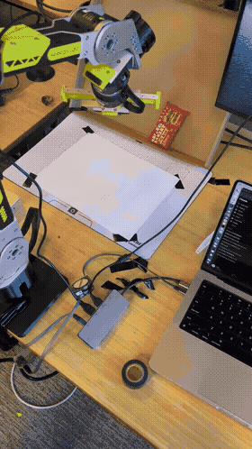

# Project Conclusion: Robot Painting Demo

## Goal

Build a robot arm demo that detects a cookie on a table and moves the arm toward it —
originally planned as an end-to-end vision-language-action (VLA) model, using ACT
(Action Chunking Transformer) trained on teleoperated demonstrations.

**Hardware:** Seeed Studio B601-DM follower arm + Star Arm (reBot Arm 102) leader arm,
controlled via CAN bus over USB, using the LeRobot framework.

---

## What We Tried

### Phase 1 — Hardware Bring-Up

Getting the arms to move at all took significant debugging:

- Flashed the B601 firmware, wired CAN bus, learned the `motorbridge` SDK
- Discovered that Damiao motors only work reliably in **POS_VEL mode** — MIT, VEL, and
  FORCE_POS modes all fail with `"register 10 not received within 1s"`
- Hit follower arm drift: when a motor enters error state (red LED), `get_state()` returns
  `None`, the library falls back to `0.0°`, and the arm snaps violently to its zero
  position — diagnosed in `FOLLOWER_DRIFT_ANALYSIS.md`
- Serial port conflicts (`Device or resource busy`) from zombie Python processes were a
  recurring nuisance throughout the project

### Phase 2 — Teleoperation + Data Collection

Leader+follower teleoperation worked via `lerobot-record`, but with pitfalls:

- **Camera fps locked at 30** — setting `fps=15` raises a hard error (`RuntimeError:
  OpenCVCamera failed to set fps=15 (actual_fps=30)`)
- **Camera timeout crashes** — `OpenCVCamera.async_read()` throws `TimeoutError` under
  load; fixed by caching the last frame and returning it on timeout
- **lerobot-record keyboard controls are not Enter** — save episode with `→` right arrow,
  discard with `←` left arrow, stop with `Esc`; Enter does nothing
- **Calibration misalignment** — if leader and follower are not at the exact same joint
  angles when calibration runs, the follower snaps to a wrong position the moment
  teleoperation starts; had to write `calibrate.sh` to zero both arms together
- **Dataset root conflicts** — `lerobot-record` refuses to write into an existing
  directory; each trajectory needed its own `datasets_<name>/` folder
- LeRobot v3 does not support training on multiple datasets natively — had to write
  `merge_datasets.py` to concatenate parquet files and ffmpeg-concat videos manually

### Phase 3 — ACT Training

Trained a 52M-parameter ACT model for ~43K steps on ~55 merged episodes (13,826 frames).

**Result: the model did not generalize.** Offline evaluation showed high per-joint MAE
and trajectories that bore little resemblance to the demonstrations. Key factors:

- **Insufficient data diversity** — all demonstrations were recorded in one fixed camera
  and lighting setup; the model memorized rather than generalized
- **No camera in the control loop** — the B601 has no onboard camera; top/side cameras
  were external USB webcams with no calibrated pose, making spatial grounding hard
- **POS_VEL stiffness** — the follower arm resists hand guidance (cannot be moved by
  hand while enabled), so all data had to be collected via leader arm teleoperation;
  collecting high-quality, varied demonstrations was slow and physically awkward
- **Training infra on a MacBook** — training on Apple Silicon (MPS) is slow and
  lacks the iteration speed needed to debug a learning pipeline quickly; 43K steps
  took hours and still hadn't converged

### Phase 4 — Algorithmic Fallback (What Actually Worked)

Scrapped the ML approach entirely. Replaced it with:

1. **Cookie detection** (`detect_cookie.py`): click on the cookie in a live camera view
   to sample its HSV color range; `CookieDetector.detect()` uses HSV threshold +
   largest-contour centroid vs. frame center to return `"left"` / `"right"` / `"none"`
2. **Trajectory recording** (`record.sh`): record any named motion via leader+follower
   teleoperation with `lerobot-record`; data stored as LeRobot parquet files
3. **Trajectory replay** (`replay.py`): load the parquet, read motor states immediately
   after connect to hold position (prevent snap), then replay at original timing
4. **Demo loop** (`demo.py`): detect cookie → `subprocess` call to `replay.py`

This worked reliably on the first try.

---

## Key Pitfalls Summary

| Area | Pitfall |
|------|---------|
| Motors | Only POS_VEL mode works on Damiao; all other modes silently fail |
| Motors | Error state (red LED) → `get_state()` returns `None` → arm snaps to 0° |
| Motors | POS_VEL mode is stiff; arm cannot be hand-guided while enabled |
| Recording | Camera fps cannot be changed from its native rate (30fps on our webcams) |
| Recording | Camera `async_read()` times out under CPU load; must cache last frame |
| Recording | `lerobot-record` saves/discards with arrow keys, not Enter |
| Recording | Both arms must be at the same pose before calibration |
| Recording | Each dataset needs a unique root directory |
| Training | LeRobot v3 does not support multi-dataset training natively |
| Training | ACT on 55 episodes is far too little data to generalize |
| Training | No GPU → training on MPS is too slow for rapid experimentation |
| Serial | `Device or resource busy` — always `kill` stale Python processes before reconnecting |

---

## Tech Stack Learned

- **LeRobot** (HuggingFace) — `lerobot-record`, `lerobot-train`, `lerobot-calibrate`;
  dataset format (parquet + video), config system, teleop interface
- **motorbridge SDK** — CAN bus motor control for Damiao actuators over USB serial
- **ACT (Action Chunking Transformer)** — transformer-based imitation learning policy;
  understands chunked action prediction, positional encoding, dataset requirements
- **Seeed B601-DM** — 6-DOF + gripper follower arm; motor IDs, CAN IDs, joint limits,
  calibration flow via `set_zero_position()`
- **reBot Arm 102** — leader arm; Dynamixel-based; joint direction mapping for
  leader→follower coordinate alignment
- **OpenCV** — camera capture, HSV color detection, contour analysis
- **HuggingFace dataset format** — parquet schema (`action`, `timestamp`, `observation.*`),
  `meta/info.json`, chunk layout

---

## Conclusion

End-to-end ML (ACT/VLA) is powerful but requires more than a weekend:
enough data diversity, a calibrated camera, GPU training, and careful eval infrastructure.
With limited hardware and a MacBook, the algorithmic approach — color detection + recorded
trajectory replay — was the right call for a working demo.

The most valuable outcome of this project is a clear map of the hardware pitfalls,
the LeRobot framework internals, and exactly where the ML pipeline breaks down —
a foundation for a more serious attempt with better data collection and compute.
