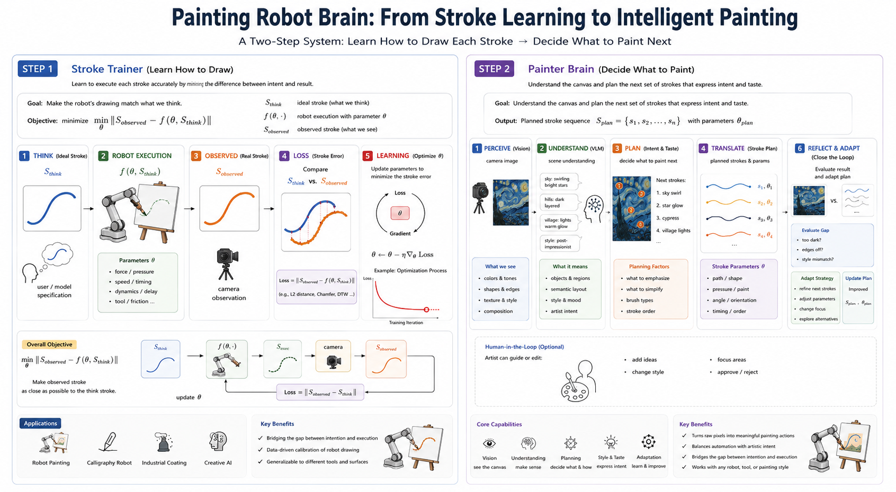

Painting Robot! It is not just another printer. 
Ours sees the canvas after each stroke, compares it to intent, and adapts the next action — pressure, angle, paint loading. 
Human can also take action in the loops -- a good demonstration of harmony between silicon and carbon. 

1) stroke trainer, learn the basic skills, by minimizing
      || stroke_observed - stroke_planned || 
     here stroke_observed = f( theta, stroke_planned)  is what robot actual draws given the plan
2) painter brain, understand the camera picture, can plan feature strokes, artist taste, etc.
     this part is purely software, agentic and VLM.
   
