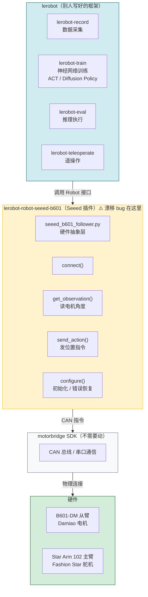

# 系统架构

## 各层职责

| 层 | 代码 | 职责 | 需要改动？ |
|----|------|------|-----------|
| **lerobot 框架** | `vendor/lerobot` | 数据格式、训练循环、神经网络（ACT 等）、推理 | 否 |
| **Seeed 插件** | `vendor/lerobot-robot-seeed-b601` | 把 lerobot 抽象指令翻译为 CAN 命令，读写电机状态 | **是（修漂移）** |
| **motorbridge SDK** | pip 包 | CAN/串口底层通信 | 否 |
| **硬件** | B601-DM、Star Arm 102 | 执行物理动作 | — |

## 漂移 bug 位置

`seeed_b601_follower.py` → `get_observation()`：电机变红停止响应时，返回 `0.0°` 而非上一帧位置，lerobot 不感知，直接把 `0°` 当作目标发出去，导致手臂甩向零位。

详见 [`FOLLOWER_DRIFT_ANALYSIS.md`](./FOLLOWER_DRIFT_ANALYSIS.md)。
