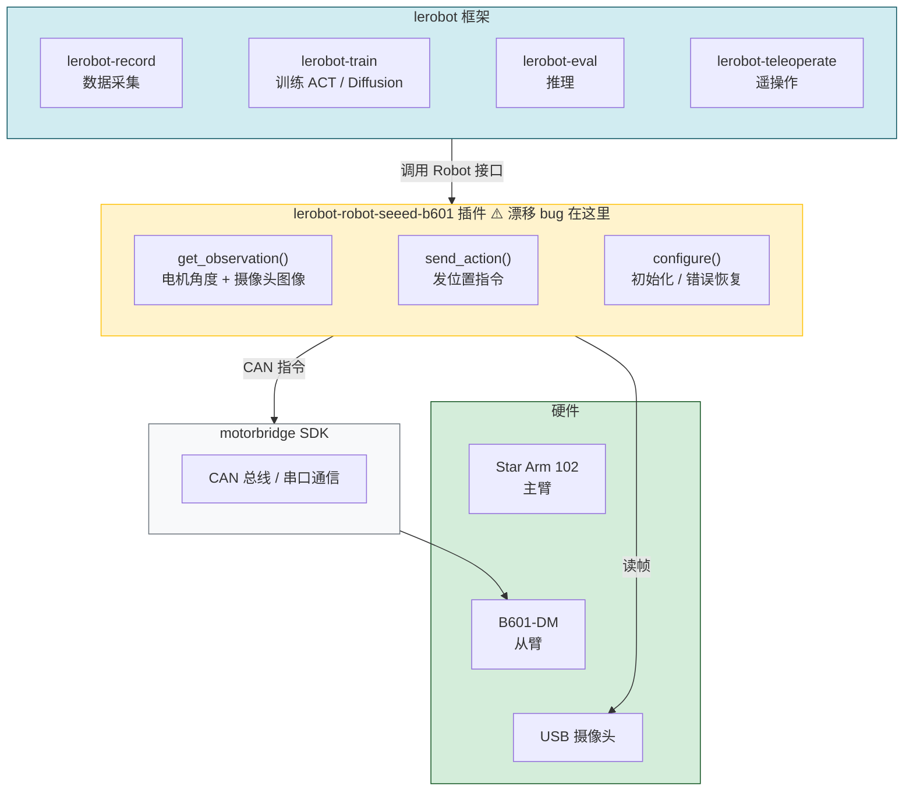
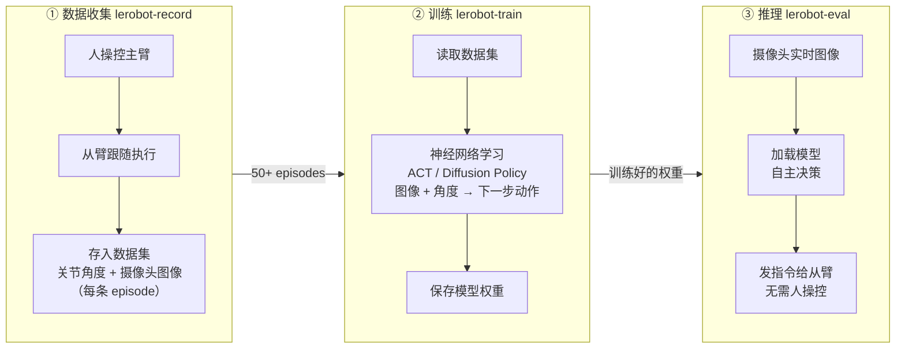

# 系统架构

---

## 标准流程：数据收集 → 训练 → 推理

### 各阶段说明

| 阶段 | 谁在控制从臂 | 摄像头作用 | 输出 |
|------|------------|-----------|------|
| **数据收集** | 人（通过主臂） | 录像，和角度一起存 | 数据集 |
| **训练** | 无（离线） | 作为网络输入特征 | 模型权重 |
| **推理** | 神经网络 | 实时输入，驱动决策 | 机器人自主行动 |
